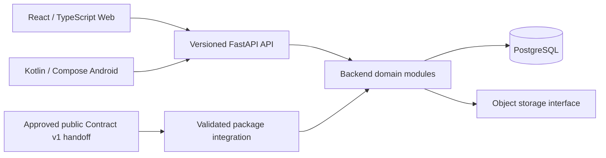

# Architecture

The baseline is a monorepo with one modular backend and two clients. The
boundaries were accepted in Phase 0. Phase 1 now implements backend infrastructure;
Phase 2 adds curriculum release integration; accepted Phase 3 adds [shared identity](identity.md).
[Phase 4 Learning Core](learning-core.md) is accepted and merged under approved
public-safe normative rules. [Phase 5 Web](../web/README.md) scope is reviewed;
implementation awaits required voice policy. Clients remain unimplemented.

The handoff is an artifact boundary, never a private-repository dependency.
Production corpus/media stay outside source control and public CI.

| Boundary | Ownership |
| --- | --- |
| Backend | Canonical learning rules, authorization, progress and entitlements |
| Web / Android | Presentation, accessibility, local interaction and platform capabilities |
| Android persistence | Later offline operations and version-aware synchronization |
| Public API contracts | Client compatibility and reviewed interface evolution |
| Course Package Contract | Upstream-defined data interchange; imported unchanged after approval |
| Infrastructure | Environment definitions; secrets injected externally |

Use domain modules rather than services by default. Candidate domains include
identity, curriculum/release management, learning/evaluation, progress/review,
media, gamification, access/billing, and administration. Current infrastructure layout is described in [backend runtime](backend-runtime.md);
product module layouts follow their future authorized phases.
Each module owns its persistence and public interfaces. Avoid cross-module ORM
writes and shared mutable domain logic. Public DTOs do not expose storage models.
The backend is authoritative; clients do not independently decide access rights,
canonical mastery, purchases, or reconciliation outcomes.

[ADRs](../adr/README.md) capture accepted engineering decisions.
[Product direction](product-direction.md) preserves the public release baseline.
